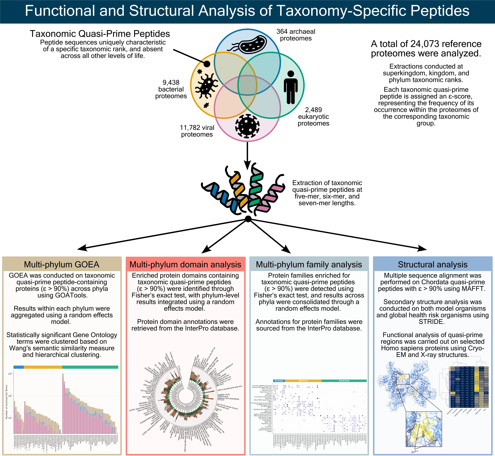

# Taxonomic quasi-primes: peptides charting lineage-specific adaptations and disease-relevant loci

## Overview
This repository contains the analysis pipeline and findings for identifying unique peptide sequences, termed **taxonomic quasi-prime peptides**, that are specific to taxonomic groups. By analyzing proteomes across 24,073 species, the study identifies these peptides unique to superkingdoms, kingdoms, and phyla, offering insights into evolutionary divergence and functional roles.

---

## Graphical Abstract
<p align="center">
  
</p>

## How to reproduce
1. **Clone this repository:**
   ```bash
    git clone https://github.com/Georgakopoulos-Soares-lab/taxonomic_quasi_primes
    cd taxonomic_quasi_primes
    ```

2.  **Obtain taxonomic quasi-prime raw data for the desired taxonomic rank:**
    * Download the extracted taxonomic quasi-prime raw data used in this manuscript from our [Zenodo repository](https://zenodo.org/records/14385095).

3. **Install the required libraries used for the analysis:**
    ```bash
    pip install -r requirements.txt
    ```
4. **Install STRIDE for the secondary structure evaluation:**
    Instructrions to install the STRIDE (Structural identification) algorithm can be found in the [ssbio documentation](https://ssbio.readthedocs.io/en/latest/instructions/stride.html)

5. **Make the C program to extract taxonomic quasi-prime regions from PDB files:**
    ```bash
    gcc -fopenmp -O2 -o pdb_quasi_prime_extractor pdb_quasi_prime_extractor.c
    ```
6. **Configure the `config.yaml` file to contain the paths specific to your enviroment**
7. **Execute the Python scripts in this order**
    1. descriptive_statistics.ipynb
    2. multi_phylum_GOEA_pre_processing.ipynb
    3. multi_phylum_GOEA.ipynb
    4. multi_phylum_protein_entry_analysis_pre_processing.ipynb
    5. multi_phylum_protein_entry_analysis.ipynb
    6. combine_enrichment_results.ipynb
    7. multi_phylum_enrichment_plots.ipynb
    8. sec_struct_clustermaps.ipynb
    9. alphamissense_analysis.ipynb

---

## Detailed explanation for each script present in the repository


## Citation

The citation will be placed here after publication.

## Contact
For any questions or support, please contact:
* izg5139@psu.edu
* left.bochalis@gmail.com


## How to extract your own taxonomic quasi-prime raw data
1. **Install Google SparseHash:**
    * **Ubuntu/Debian:**
       ```bash
       sudo apt-get install libsparsehash-dev
       ```
    * **CentOS/RHEL/Fedora:**
       ```bash
       # For older versions using yum
       sudo yum install sparsehash-devel

       # For newer versions using dnf
       sudo dnf install sparsehash-devel
       ```
   * **macOS (with [Homebrew](https://brew.sh/))**:
       ```bash
       brew install google-sparsehash
       ```
2.  **Make sure have a C++11 compatible compiler and then compile the C++ scripts present in the `extraction_scripts` directory:**
    ```bash
    g++ -std=c++11 -O2 -o superkingdom_qps superkingdom_qps.cpp
    g++ -std=c++11 -O2 -o kingdom_qps kingdom_qps.cpp
    g++ -std=c++11 -O2 -o phylum_qps phylum_qps.cpp
    ```
3. **Download proteome data from the [UniProt database](https://www.uniprot.org/)**
4. **Obtain a tab-separated file, that maps each proteome to a specific taxonomic rank:**
    The file must contain 2 columns, one with the proteome ID and one with the assigned taxonomic rank.
    For example, if you want to extract data at the superkingdom level the mapping file should look like this:
    ```text
    UP000000242_399549  Archaea
    UP000000536_69014   Archaea
    UP000000263_383372	Bacteria
    UP000000268_329726	Bacteria
    UP000813426_2823209	Eukaryota
    UP000815604_1639000	Eukaryota
    UP000202218_1923543	Viruses
    UP000202219_1821537	Viruses
    ```
5. **Extract quasi-primes:**
    Using the desired compiled C++ script, you can extract 
    For exam
    ```bash
    ./superkingdom_qps input_mappings.txt output_results.txt
